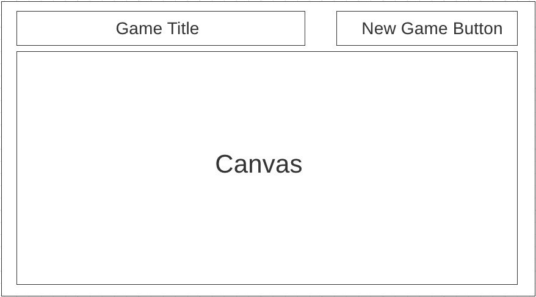
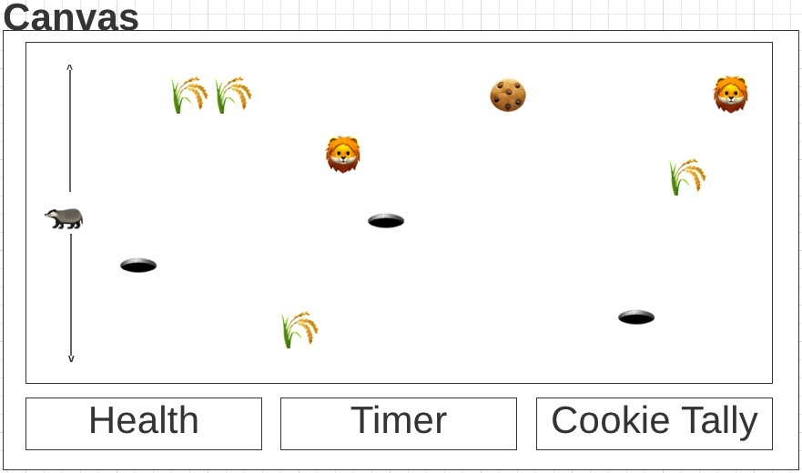

# Badger Dodger

You're a hungry badger in the Savannah and cookies have spontaneously began sprouting up from the ground! Avoid lions and pitfalls to acquire 3 cookies and fill that belly up before night falls.

# Gameplay
Scrolling 2D environment where you move the badger up or down to avoid obstacles and reach the ultimate goal of acquiring all cookies in the game field. Use "W" key to move the badger up and the "S" key to move the badger down. Once timer hits zero, the game is lost.

# Wireframe

# MVP
* Render game start button
* Render game window
* Render savannah background
* Render player
    1. Use badger sprite
    2. Use W & S for up/down movement
* Render collision objects
    1. Lions
    2. Cookies
* Render grass sprite
* Render health bar
    1. Set health bar to 3 "damage points"
        * Lions cause 1 damage point
    2. Set lose game condition when health reaches 0
* Render timer
    1. Set timer to 30 seconds and decrement
* Track number of cookies acquired
    1. Set win game condition when 3 cookies acquired
        * innerText message of belly full/game won
* Continuously scroll game background so new collision objects appear

# Stretch Goals
* Every 10 seconds change game window opacity until pitch black to indicate shifting day light
    1. innerText message of night fall/game over
* Include spacebar for jumping
    1. Differentiate up movement vs. jump movement so game logic doesn't get confused
        * Pitfalls are jumpable
        * Jumping lions causes 3 damage points
            * innerText message of caught in air/game over
        * Jumping a cookie doesn't get acquired
        * Movement on screen to indicate a jump has occurred 
* Insert new collision object after 15 seconds
    1. Hawk sprites that dart across the screen at an angle/diagonally 
        * Hawk collision causes 2 damage points
        * Randomize where a hawk will dart across the screen
    2. Pitfalls
        * Falling into a pit causes 3 damage points
* Repeating movement of lion within a specified direction
* Fade to a dark cave background image when pitfall lose condition triggered
* Include attack for badger
    1. Differentiate attack from standard collision
        * Hawks disappear if attacked by badger
        * Lions are scared off by badger attack and move from "point A" to "point B"
            * Change lion sprite to sad/scared when attacked
* Auto-generate new "terrain" each time a new game is started
    1. Grass & collision objects are placed in new places
* Make movement "smooth"

# Technology Used
* HTML
* CSS
* JavaScript
* Additional items here